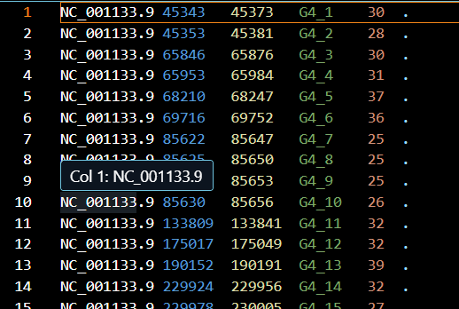
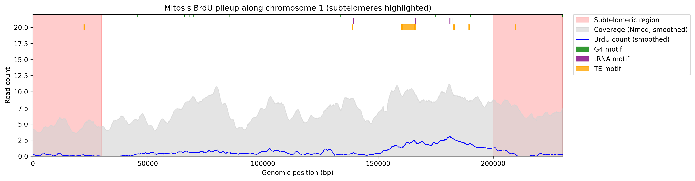

# BrdU Analysis of Nanopore 
## Requirements
First create a virtual environment by running these commands:
```bash
virtualenv .venv
source .venv/bin/activate
```
Once you have your virtual environment created and running, run the following command to install the requirements:
```bash
pip install -r requirements.txt
```
## Overview
This project provides a pipeline for extracting and visualizing BrdU-related genomic features in Nanopore sequencing data for the W303 strain on yeast. It uses publicly available NCBI genome data, to pare G4 motifs, tRNA, and transposable elements. We then plot it on a chromosome browser.
## Data Acquisition
**NOTE: Make sure to install NCBI Datasets CLI tool. The documentation is found [here](https://www.ncbi.nlm.nih.gov/datasets/docs/v2/command-line-tools/download-and-install/):**
```bash
datasets download genome accession GCA_002163515.1 \
 --include gff3,genome
```
```bash
unzip ncbi_dataset.zip
``` 
## Parsing
**NOTE: More information on the parsers can be found under the parser's designated directory. For example, **src/parsing/G4** will have a README.md explaining the G4 parser.**
We created three different parsers for genomic features (G4 motifs, tRNA, and transposable elements (TE)). We got all of our data from
[NCBI](__https://www.ncbi.nlm.nih.gov/datasets/genome/GCA_002163515.1/__) using the CLI datasets tool. I was able to download a .fna and
.gff file for extraction. This is a template of what all the files look like after extraction:

### G4
**NOTE: Before running G4 extraction, you need to run the G4 Hunter tool under the tools directory. The README.md under the tools directory provides instructions on how to run the tool.**
We use the G4 Hunter tool on the .fna file provided from NCBI. After running the G4 Hunter tool, we will get a .txt file named 
**GCF_ID Number_Merged.txt**. This contains all the start/end coordinates along with their length for the W303 strain. We then
will create a parser that will extract the start/end coordinates along with the length from the .txt file. It is then saved into
a .bed format to make it easier to plot. This can be found in the **src/parsing/G4** directory.
```bash
python src/parsing/G4/G4_parser.py
```
### tRNA
Since the .GFF file from NCBI contains embeddings on tRNA, we will use **Biopython** to extract the information we need. The source
code can be found under **src/parsing/tRNA** directory. The code extracts all the tRNA annotations found in the .GFF file and converts
it into a .bed format to make it easier to plot.
```bash
python src/parsing/tRNA/tRNA_parser.py
```
### Transposable Elements (TE)
The .GFF file from NCBI also contains embeddings on transposable elements, so we will use the **Biopython** package to extract the 
information we need. The source code can be found under **src/parsing/TE**. The code extracts both TE bodies + LTRs, or it can only
extract TE bodies. If you want both TE bodies + LTRs, comment out the TE bodies only code and vice versa. The output will also be saved
in a .bed file format to make it easier to plot.
```bash
python src/parsing/TE/TE_parser.py
```
## Results/Plotting 
After performing the extraction and saving all the data we need in a .bed file format, we will use this to plot all the genome features. The source code for this can be found in **src/plotting/M_Phase/genome_browser/M_phase_chromosome_plotting.py**. We will get all the data we want from each chromosome in the genome and plot it. Here is an example:
<!---  --->
To produce these plots, run the following command:
```bash
python src/plotting/M_Phase/genome_browser/M_phase_chromosome_plotting.py
```
## References/Resources
### NCBI
This project uses publicly available genomic data from National Center for Biotechnology Information ([NCBI](https://www.ncbi.nlm.nih.gov/datasets/genome/GCA_002163515.1/)):

- Organism : *Saccharomyces cerevisiae* (W303)

Data was downloaded using the NCBI Datasets CLI, accessed December 2025.
### Biopython
This project uses the Biopython tool to extract .GFF file embeddings for important genome features. It is also used to generate the genome diagrams. The documentation can be found [here](https://biopython.org/). In this project we used version 1.86. 
### G4 Hunter Tool 
This project uses the G4 Hunter tool created by **AnimaTardeb** to extract G4 motifs from a .fasta file format. The latest version of this tool is found on [GitHub](https://github.com/AnimaTardeb/G4Hunter).
